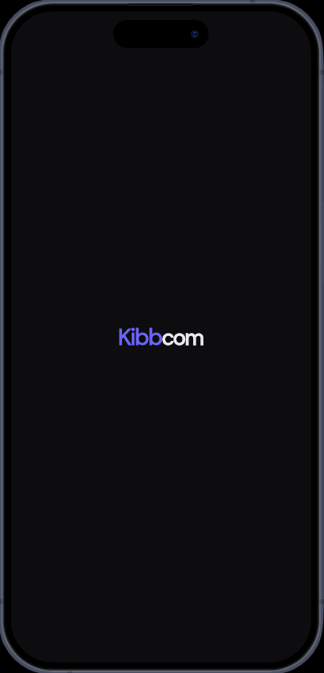

# Kibbcom — Site Management App

A Flutter enterprise dashboard app built with MVVM architecture and 
Riverpod state management. Allows managers to monitor and manage 
operational sites in real time.

---
## App Preview

<table>
<tr>

<td align="center">
<b>Splash Screen</b><br><br>

</td>

<td align="center">
<b>Home Screen</b><br><br>

</td>

<td align="center">
<b>Fetch Screen</b><br><br>

</td>

</tr>
<tr>

<td align="center">
<b>Dashboard Screen</b><br><br>

</td>

<td align="center">
<b>Site Detail Screen</b><br><br>

</td>

<td align="center">
<b>Not Match Found Screen</b><br><br>

</td>

</tr>
</table>


## What the app does

- Shows a splash screen with an animated brand reveal on launch
- Home screen with a hero card and navigation to the dashboard
- Dashboard lists all operational sites fetched from a simulated API
- Search bar filters sites by name in real time
- Toggle switches change site status between Active and Maintenance
- Summary cards show the total count of Active and Maintenance sites
- Tapping a site card opens a bottom sheet with full details
- Contact Manager button opens the native phone dialler
- Notification sidebar slides in from the right
- Three dot menu with About dialog

---

## Tech stack

| | |
|---|---|
| Framework | Flutter 3.11.0 |
| Language | Dart 3.0 |
| State management | Riverpod (StateNotifier) |
| Architecture | MVVM |
| Animations | flutter_animate |
| Fonts | Google Fonts — DM Sans |
| Phone dialler | url_launcher |
| Device preview | device_preview (desktop only) |

---
## Architecture — MVVM

The app strictly follows a 3-layer MVVM pattern.

**Model** — owns the data. `SiteModel` defines the data structure
and `mockApiResponse()` simulates what a real REST API would return.

**ViewModel** — owns the state. `SiteViewModel` extends
`StateNotifier` and handles fetching, filtering, and toggling.
All Riverpod providers live here.

**View** — owns the UI. Screens and widgets only read from providers
and call ViewModel methods. No business logic in the UI layer.

---
## 📁 Folder Structure

```
lib/
├── model/
│   └── site_model.dart               ← data class + mock API response
│
├── view/
│   ├── screens/
│   │   ├── splash_screen.dart        ← animated launch screen
│   │   ├── home_screen.dart          ← landing page
│   │   ├── dashboard_screen.dart     ← main site list
│   │   └── site_detail_sheet.dart    ← bottom sheet
│   │
│   ├── widgets/
│   │   ├── app_bar_widget.dart       ← reusable app bar
│   │   ├── site_card.dart            ← individual site card
│   │   ├── site_search_bar.dart      ← search input
│   │   ├── status_summary_cards.dart ← active/maintenance counts
│   │   └── loading_widget.dart       ← shimmer skeleton loader
│   │
│   └── theme/
│       └── app_theme.dart            ← colors, fonts, theme
│
├── viewmodel/
│   └── site_viewmodel.dart           ← all state logic and providers
│
└── main.dart                         ← app entry point
```
---
## Packages used

| Package | Purpose |
|---|---|
| flutter_riverpod ^2.5.1 | State management |
| flutter_animate ^4.5.0 | Animations and shimmer |
| google_fonts ^6.2.1 | DM Sans font |
| url_launcher ^6.3.0 | Phone dialler |
| device_preview ^1.1.0 | Device simulation on desktop |

---

## Theme

The app uses a premium dark theme throughout.

| Color | Value | Used for |
|---|---|---|
| Background | #0D0D0F | App background |
| Surface | #16161A | Sidebar and sheets |
| Card | #1C1C22 | Cards and inputs |
| Accent | #6C63FF | Buttons and icons |
| Green | #34D399 | Active status |
| Amber | #FBBF24 | Maintenance status |
| Text primary | #EAEAF0 | Headings |
| Text secondary | #8888A0 | Subtitles and hints |

---

## Device preview

Device preview is automatically enabled when running on a
desktop or a browser with a screen width of 1024px or more.
It is disabled on Android, iOS, and mobile or tablet browsers.

---

## Notes

The API fetch is simulated using `Future.delayed` with a 2-second
delay. To connect a real API, replace the `mockApiResponse()` method in
`site_viewmodel.dart` with an actual HTTP call using `http` or `dio.`
and update `SiteModel` with a `fromJson` factory constructor.

---

Built with Flutter by Siljo❤️

